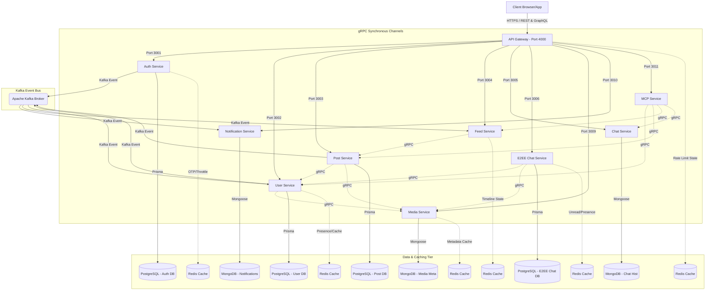

# Waave Microservice Platform

Waave is an enterprise-grade, production-minded NestJS microservices platform. It is built around clean domain boundaries, high-performance synchronous gRPC communication, asynchronous event-driven Kafka messaging, and multi-tier caching via Redis.

---

## 📖 Table of Contents

1. [Platform Architecture](#1-platform-architecture)
2. [Project Structure Layout](#2-project-structure-layout)
3. [Service Catalog & Ports Matrix](#3-service-catalog--ports-matrix)
4. [In-Depth Service Specifications](#4-in-depth-service-specifications)
   - [API Gateway](#api-gateway-appsapi-gateway)
   - [Auth Service](#auth-service-appsauth-service)
   - [User Service](#user-service-appsuser-service)
   - [Post Service](#post-service-appspost-service)
   - [Feed Service](#feed-service-appsfeed-service)
   - [Chat Service](#chat-service-appschat-service)
   - [E2EE Chat Service](#e2ee-chat-service-appse2ee-chat-service)
   - [Media Service](#media-service-appsmedia-service)
   - [Notification Service](#notification-service-appsnotification-service)
   - [MCP Service](#mcp-service-appsmcp-service)
5. [Shared Library Specifications](#5-shared-library-specifications)
   - [gRPC Clients Library (`libs/grpc-clients`)](#grpc-clients-library-libsgrpc-clients)
   - [Common Library (`libs/common`)](#common-library-libscommon)
   - [Kafka Library (`libs/kafka`)](#kafka-library-libskafka)
   - [Proto-Schema Library (`libs/proto-schema`)](#proto-schema-library-libsproto-schema)
6. [Local Environment Setup](#6-local-environment-setup)
7. [Operational & Security Architecture](#7-operational--security-architecture)

---

## 1. Platform Architecture

The Waave architecture balances immediate response pathing with eventual consistency through a combination of sync/async internal messaging:



### Core Communication Architecture

- **gRPC (Sync)**: Used for interactions requiring instant verification or blocking data return. Examples include authorization token verification, profile details lookup, media status reviews, and message metadata hydration.
- **Kafka (Async)**: Decoupled events stream. Used for operations that can be resolved eventually, reducing response lag on core HTTP endpoints. For example, profile generation on signup, timeline rebuilds on post creation, and transactional email distribution.

---

## 2. Project Structure Layout

This repository is organized as a monorepo containing application workspaces (`apps/`) and reusable modular utilities (`libs/`):

```text
Waave/
├── apps/
│   ├── api-gateway/            # Dual REST & GraphQL Frontdoor and Orchestration layer
│   ├── auth-service/           # Identity Provider and Token Manager
│   ├── user-service/           # Social profile management and relations lookup
│   ├── post-service/           # Post creation and cron-scheduled publisher
│   ├── feed-service/           # Timeline Aggregation and Trending Scoring
│   ├── chat-service/           # Real-time workspace chat messages & group server (MongoDB)
│   ├── e2ee-chat-service/      # End-to-End Encrypted chat service utilizing Double Ratchet envelopes
│   ├── media-service/          # Media asset metadata and variant conversion
│   ├── notification-service/   # Message-driven outbound mail/delivery & in-app alerts
│   └── mcp-service/            # Model Context Protocol tools and Agent service
├── libs/
│   ├── grpc-clients/           # Unifies and exposes gRPC clients (User, Post, Media, etc. to @app/clients)
│   ├── common/                 # Global validation filters, inter-service guards, and decorators
│   ├── kafka/                  # Kafka module wrap and generic event providers
│   └── proto-schema/           # Protocol Buffers (*.proto) and generated TS interfaces
├── storage/                    # Local directory target representing image and media assets
│   ├── avatars/                # Scaled profile avatar storage folder
│   ├── covers/                 # Cover photo variant directory
│   ├── images/                 # Post image asset folder
│   ├── videos/                 # Video upload storage directory
│   └── temp/                   # Temporary cache of uploaded file streams
├── docker/                     # Dockerized infrastructure and startup compose files
│   ├── compose/                # Compose stacks for infrastructure and services
│   ├── mongodb/                # MongoDB init/bootstrap assets
│   └── postgres/               # PostgreSQL init/bootstrap assets
├── package.json                # Custom workspace run-scripts and engine drivers
└── tsconfig.json               # Global compiler configuration
```

> Note: this repository uses the compose files under `docker/compose/*.yml` rather than a single root `docker-compose.yaml` file.

---

## 3. Service Catalog & Ports Matrix

The platform functions using the following defaults, customizable via workspace environment configurations:

| Service Name          |    Primary Protocol    |   Port Config   | Backing Database            | Caching Strategy     | Key Directories                                                                                                    |
| :-------------------- | :--------------------: | :-------------: | :-------------------------- | :------------------- | :----------------------------------------------------------------------------------------------------------------- |
| **API Gateway**       | **HTTP/REST & GraphQL**|     `4000`      | None                        | Redis (`RedisGW`)    | [`apps/api-gateway`](file:///Users/macbookair/Desktop/code/dream-project/waave/apps/api-gateway)                   |
| **Auth Service**      |       gRPC / HTTP      | `3001` / `4001` | PostgreSQL (`PostgresAuth`) | Redis (`RedisAuth`)  | [`apps/auth-service`](file:///Users/macbookair/Desktop/code/dream-project/waave/apps/auth-service)                 |
| **User Service**      |       gRPC / HTTP      | `3002` / `4002` | PostgreSQL (`PostgresUser`) | Redis (`RedisUser`)  | [`apps/user-service`](file:///Users/macbookair/Desktop/code/dream-project/waave/apps/user-service)                 |
| **Post Service**      |       gRPC / HTTP      | `3003` / `4003` | PostgreSQL (`PostgresPost`) | Redis (`RedisPost`)  | [`apps/post-service`](file:///Users/macbookair/Desktop/code/dream-project/waave/apps/post-service)                 |
| **Feed Service**      |       gRPC / HTTP      | `3004` / `4004` | None                        | Redis (`RedisFeed`)  | [`apps/feed-service`](file:///Users/macbookair/Desktop/code/dream-project/waave/apps/feed-service)                 |
| **Chat Service**      |       gRPC / HTTP      | `3005` / `4005` | MongoDB (`MongoDBChat`)     | Redis                | [`apps/chat-service`](file:///Users/macbookair/Desktop/code/dream-project/waave/apps/chat-service)                 |
| **E2EE Chat Service** |       gRPC / HTTP      | `3006` / `4006` | PostgreSQL (`PostgresE2EE`) | Redis (`RedisE2EE`)  | [`apps/e2ee-chat-service`](file:///Users/macbookair/Desktop/code/dream-project/waave/apps/e2ee-chat-service)       |
| **Media Service**     |       gRPC / HTTP      | `3009` / `4009` | MongoDB                     | Redis (`RedisMedia`) | [`apps/media-service`](file:///Users/macbookair/Desktop/code/dream-project/waave/apps/media-service)               |
| **Notification**      |    gRPC / HTTP / WS    | `3010` / `4010` | MongoDB (`MongoDBNotif`)    | Redis                | [`apps/notification-service`](file:///Users/macbookair/Desktop/code/dream-project/waave/apps/notification-service) |
| **MCP Service**       |       gRPC / HTTP      | `3011` / `4011` | None                        | None                 | [`apps/mcp-service`](file:///Users/macbookair/Desktop/code/dream-project/waave/apps/mcp-service)                   |

---

## 4. In-Depth Service Specifications

### API Gateway (`apps/api-gateway`)

The ingress point of all client-side REST and GraphQL requests. It routes public requests and translates them into appropriate internal gRPC communications across all domain microservices.

#### Responsibilities & Operations

- **Request Routing**: Exposes REST interfaces and full GraphQL queries/mutations, translating payloads to downstream gRPC services (`auth`, `user`, `post`, `feed`, `chat`, `e2ee-chat`, `media`, `notification`, `mcp`).
- **GraphQL Integration**: Code-first Apollo GraphQL server with schema auto-generation (`schema.gql`) and active GraphQL Playground available at `/graphql`.
- **Form & Type Validation**: Enforces Class Validator DTOs for REST endpoints and NestJS GraphQL Input/Object Types for GraphQL operations.
- **Documentation**: Exposes interactive Swagger documentation at `/docs` and Apollo GraphQL Playground at `/graphql`.
#### Throttling & Security

- Leverages Redis rate limits (`RateLimitGuard`) and JWT authentication (`AuthGuard`) across both REST controllers and GraphQL resolvers.

#### Key Environment Configurations

- `API_GATEWAY_HTTP_PORT` (Default: `4000`)
- `AUTH_SERVICE_GRPC_URL` (Default: `localhost:3001`)
- `USER_SERVICE_GRPC_URL` (Default: `localhost:3002`)
- `POST_SERVICE_GRPC_URL` (Default: `localhost:3003`)
- `CHAT_SERVICE_GRPC_URL` (Default: `localhost:3005`)
- `E2EE_CHAT_SERVICE_GRPC_URL` (Default: `localhost:3006`)
- `MEDIA_SERVICE_GRPC_URL` (Default: `localhost:3009`)
- `NOTIFICATION_SERVICE_GRPC_URL` (Default: `localhost:3010`)
- `MCP_SERVICE_GRPC_URL` (Default: `localhost:3011`)

---

### Auth Service (`apps/auth-service`)

The Identity Provider for the platform. It manages user logins, passwords, email OTP validations, and token renewals.

#### Registration & Sign In Lifecycle

1. Gateway receives registration REST payloads and calls Auth Service over gRPC.
2. Checking database existence, it hashes passwords and writes a verified status record to PostgreSQL.
3. Generates verification OTP records in Redis and emits events to Kafka.
4. User logs in, credential check processes, JWT tokens generate, and active refresh hashes save to PostgreSQL.

#### Datastore Specification (PostgreSQL - Prisma)

Defines structural account columns under Model `users`:

| Field Name        | Data Type |     Key Type     | Purpose / Description                        |
| :---------------- | :-------- | :--------------: | :------------------------------------------- |
| `id`              | `String`  | **Primary Key**  | UUID representation string                   |
| `name`            | `String`  |        -         | User display name                            |
| `email`           | `String`  | **Unique Index** | Email address lookup index                   |
| `password`        | `String`  |        -         | bcrypt password hash                         |
| `role`            | `enum`    |        -         | Account access: `USER`, `ADMIN`, `MODERATOR` |
| `refreshToken`    | `String?` |        -         | Hashed token identifier                      |
| `isEmailVerified` | `Boolean` |        -         | Current verification indicator               |

---

### User Service (`apps/user-service`)

Governs user profile configuration details, social relationship tracking (follows), search listings, and active status presence indicators.

#### Core Capacities

- **Profile operations**: Processes database changes for biographic descriptions, matching avatars, and header files.
- **Social graph**: Connects profiles via follow links and compiles listing grids.
- **Presence checks**: Tracks active user status using temporary Redis storage keys.
- **Self-Enrichment**: Resolves `avatarMediaId` and `coverMediaId` references inside the service using `MediaGrpcClient` to return nested `UserMedia` objects instead of raw strings.

#### Datastore Specification (PostgreSQL - Prisma)

The service operates two main structures:

- **`profiles` Model**: Stores profile parameters, including `avatarMediaId`, `coverMediaId`, and count caches (followers, following, posts).
- **`follows` Model**: Connects profiles using `followerId` and `followingId` UUID pairs with a composite unique constraint.

---

### Post Service (`apps/post-service`)

Manages post creation, comment threads, reactions (likes), scheduled publish routines, and post revisions.

#### Core Capacities

- **Post Lifecycle**: Handles draft preservation, content editing, scheduled visibility publishing, and soft deletions.
- **Service-Level Enrichment**: Automatically resolves `author` profile details and associated content `media` references using the `UserGrpcClient` and `MediaGrpcClient` before returning, ensuring callers receive nested JSON.

#### Datastore Specification (PostgreSQL - Prisma)

Operates under the `posts` model tracking `id`, `authorId`, `content`, `mediaRefs` (string array), `visibility` status (PUBLIC, FOLLOWERS, PRIVATE), and `status` details.

---

### Feed Service (`apps/feed-service`)

Timeline compilation and trending calculator services built entirely stateless over Redis databases.

#### Performance Architecture

The Feed Service does not have a permanent DB, using Redis structures instead:

- **User Timelines (`feed:{userId}`)**: A Redis list storing active post IDs for followed users.
- **Trending Index (`trending:posts:global`)**: A Redis Sorted Set sorting global post IDs by engagement scores.
- **Data Hydration**: Fetches the pre-resolved `author` and `media` entities returned by the Post Service to construct feeds without extra gRPC hops.
- **Event-Driven Cache Invalidation**: Listens to Kafka interactions (`post.created`, `post.liked`, `user.profile-followed`) to rebuild lists.

---

### Chat Service (`apps/chat-service`)

Powering real-time messaging, group chat rooms, reactions, and websocket states using MongoDB.

#### Main Responsibilities

- **Socket Influx**: Handles Socket.io websocket connections at `localhost:4005/chat`.
- **Archive Persistency**: Stores conversations, messages, reactions, read status indices, and group metadata inside schema-flexible MongoDB databases.

---

### E2EE Chat Service (`apps/e2ee-chat-service`)

High-security messaging service driving end-to-end encrypted chats utilizing Double Ratchet cryptograms, ephemeral pre-keys, and client envelope routing.

#### Core Capacities

- **Direct & Group Creation**: Manages conversations by building sorted peers compounds (`directKey`).
- **Encrypted Envelopes**: Instead of plaintext, it persists device-specific envelopes containing the client-encrypted `ciphertext`, `iv`, `authTag`, and ratchet header attributes.
- **Reactions & Statuses**: Connects message reader tables and reaction triggers.

#### Datastore Specification (PostgreSQL - Prisma)

Tracks models under `conversations`, `conversation_members`, `encrypted_messages`, `message_envelopes` (ciphertext registry), `encrypted_attachments`, and `sender_key_distributions`.

---

### Media Service (`apps/media-service`)

Manages media storage processes, variant conversions (like resizing images for thumbnail and medium sizes), and media search indexes.

#### Processing Steps

1. Client pushes asset bytes via the API Gateway.
2. Gateway writes bytes to `storage/temp/` and calls the Media Service over gRPC.
3. Media Service moves files into storage buckets (`storage/images/`, etc.).
4. For image assets, resizing variants (`thumbnail` and `medium`) are automatically generated.
5. Saves asset schema parameters to MongoDB.

---

### Notification Service (`apps/notification-service`)

Listens to Kafka events to dispatch SMTP emails and pushes in-app notifications directly to active users over WebSockets.

#### In-App Alerts specifications

- **Alert Persistence**: Archive logs and subscription states are stored in MongoDB.
- **Outbound WebSockets**: Emits pushes over the `notification` channel on port `4010`.
- **Payload alignment**: Responses return a nested `sender` (User) object instead of flat metadata fields.

---

### MCP Service (`apps/mcp-service`)

Integrates LLM models with platform endpoints via the Model Context Protocol (MCP) standard, offering an autonomous execution agent for user prompts.

#### Main Responsibilities

- **Tool Servers**: Registers Zod parameter functions mapping platform services (User, Post, Feed, Chat) to LLM capabilities.
- **OpenAI Agent client**: Connects via SSE transports, executing completions (`gpt-4o-mini`) via a tool loop (max 8 iterations) and logs execution traces.

---

## 5. Shared Library Specifications

### gRPC Clients Library (`libs/grpc-clients`)

Unifies and exports public gRPC client controllers (`UserGrpcClient`, `PostGrpcClient`, `MediaGrpcClient`, etc.), providing a singular internal entry point `@app/clients` to prevent duplicate connection channels.

### Common Library (`libs/common`)

Contains global filters, auth guards, exception interceptors, and system constants.

### Kafka Library (`libs/kafka`)

Wraps the central Kafka module details, event publishers, and subscription decoders.

### Proto-Schema Library (`libs/proto-schema`)

Protobuf interfaces (`src/proto/*.proto`) compiled into TypeScript workspace typings.

---

## 6. Local Environment Setup

### 1. Quick Automated Setup

For a fully automated local development setup (assigns script permissions, checks and updates `/etc/hosts` for MongoDB replica sets, installs NPM dependencies, and compiles proto definitions):

```bash
npm run setup
```

_(If `/etc/hosts` mapping is missing, you will be prompted for your sudo password to apply it once.)_

---

### 2. Manual Prerequisites & Verification (Reference)

#### A. File Permissions

Ensure the local utility and database initialization scripts mounted to containers have execution permissions:

```bash
chmod +x pg-init/primary-init.sh
chmod +x mongo-init/replica-init.sh
```

#### B. Local DNS Configuration for MongoDB Replica Sets

When running database containers in Docker but executing NestJS microservices locally on your host machine:

- MongoDB replica sets register internally using their Docker container hostnames (e.g. `notification_mongo_db_1`).
- When the local Mongoose client connects to the replica set gateway (e.g. `localhost:27016`), the cluster returns its member topology. The client then attempts to connect directly to those nodes by hostname.
- Without local DNS mapping, your OS cannot resolve these container names, resulting in a connection crash (`MongooseServerSelectionError: getaddrinfo ENOTFOUND`).

Adding these mappings to your host system's `/etc/hosts` resolves the issue. This is a **one-time setup** that persists on your computer.

**Services using MongoDB replica sets:**

1. **Notification Service** (`apps/notification-service`, Replica Set: `notification-rs`)  
   Members: `notification_mongo_db_1:27016`, `notification_mongo_db_2:27026`, `notification_mongo_db_3:27036`
2. **Media Service** (`apps/media-service`, Replica Set: `media-rs`)  
   Members: `media_mongo_db_1:27017`, `media_mongo_db_2:27027`, `media_mongo_db_3:27037`
3. **Chat Service** (`apps/chat-service`, Replica Set: `chat-rs`)  
   Members: `chat_mongo_db_1:27015`, `chat_mongo_db_2:27025`, `chat_mongo_db_3:27035`

To map all replica sets to localhost manually, run:

```bash
sudo sh -c 'echo "127.0.0.1 notification_mongo_db_1 notification_mongo_db_2 notification_mongo_db_3 media_mongo_db_1 media_mongo_db_2 media_mongo_db_3 chat_mongo_db_1 chat_mongo_db_2 chat_mongo_db_3" >> /etc/hosts'
```

#### C. Installation & Compilation

```bash
npm install
npm run proto:generate
```

---

### 3. Launching Infrastructure & Microservices

#### 1. Supporting Containers

Launch Postgres, MongoDB, Redis, and Kafka:

```bash
docker compose up -d
```

#### 2. Run Database Migrations

```bash
npm run auth:prisma:migrate
npm run user:prisma:migrate
npm run post:prisma:migrate
npm run e2ee-chat:prisma:migrate
```

#### 3. Launch microservices

```bash
npx nest start api-gateway --watch
npx nest start auth-service --watch
npx nest start user-service --watch
npx nest start post-service --watch
npx nest start feed-service --watch
npx nest start chat-service --watch
npx nest start e2ee-chat-service --watch
npx nest start media-service --watch
npx nest start notification-service --watch
npx nest start mcp-service --watch
```

---

## 7. Operational & Security Architecture

### Data Isolation

Services own their respective datastores. Relational tables are private to their owning service. Direct cross-service database queries are prohibited.

### Secrets Management

Vault environments must be used for production clusters, configuring tokens securely over TLS.

### Message Processing Policies

Kafka handlers implement idempotency validators checking message IDs to prevent redundant persistence from duplicate events.
